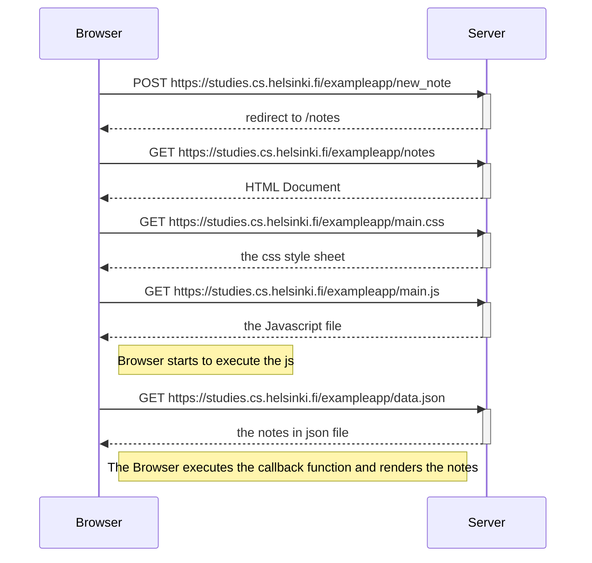

```mermaid

sequenceDiagram
    participant Browser
    participant Server

    Browser->>Server: POST https://studies.cs.helsinki.fi/exampleapp/new_note
    activate Server
    Server-->>Browser: redirect to /notes
    deactivate Server

    Browser->>Server: GET https://studies.cs.helsinki.fi/exampleapp/notes
    activate Server
    Server-->>Browser: HTML Document
    deactivate Server

    Browser->>Server: GET https://studies.cs.helsinki.fi/exampleapp/main.css
    activate Server
    Server-->>Browser: the css style sheet
    deactivate Server

    Browser->>Server: GET https://studies.cs.helsinki.fi/exampleapp/main.js
    activate Server
    Server-->>Browser: the Javascript file
    deactivate Server

    Note right of Browser: Browser starts to execute the js 

    Browser->>Server: GET https://studies.cs.helsinki.fi/exampleapp/data.json
    activate Server
    Server-->>Browser: the notes in json file
    deactivate Server

    Note right of Browser: The Browser executes the callback function and renders the notes

```